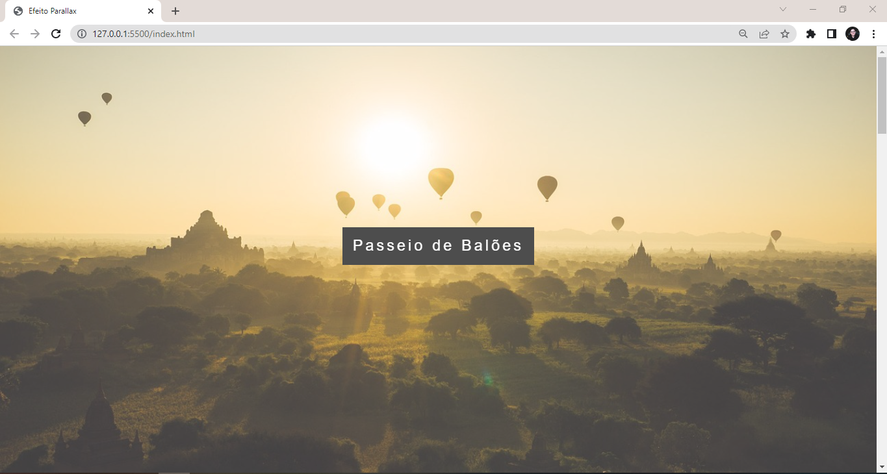
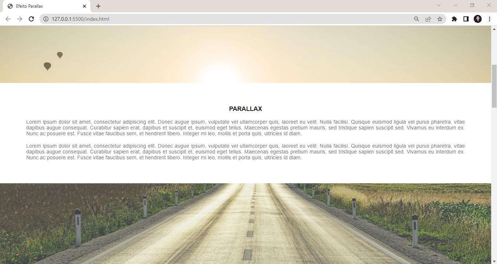
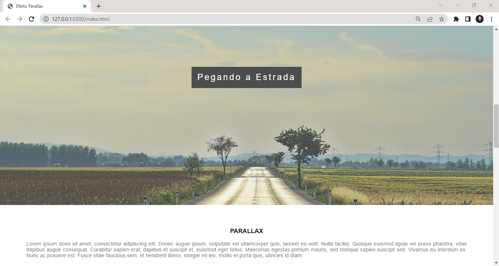

# Parallax
Pequeno projeto desenvolvido no curso "Desenvolvimento Web Completo 2022, com a finalidade de estudar o efeito paralaxe utilizando HTML e CSS.

Clique <a href="https://isabellacpmelo.github.io/parallax/">aqui</a> para acessar o projeto.

<a href="https://isabellacpmelo.github.io/parallax/"> 

## Ferramentas utilizadas:
* HTML5
* CSS3

## Print do Projeto
  
### Print 1

### Print 2

### Print 3

